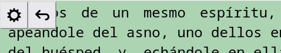
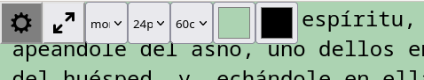

# Using StW

## Bar on Reading Mode
It tries to be minimal as posible.

* **settings**: Enter setting mode.
* **back**: Back to previous page.

## Bar on Settings Mode
Open, set and close. You need to do this at least once by device.  
  
* **settings**: Back to reading mode.
* **fullscreen**: The application was design to be used fullscreen like a reader, focus on content.
* **font-family**: First I set a font that I feel comfortable reading.
* **font-family**: Then I choose a size that is easy to see and doesn't requires effort.
* **max-width**: If the display is wide enough, I select a size that I can go from start to end of line without moving too much the eyes.
* **background-color**  
* **text-color**: With these two you set your own light and dark mode.
